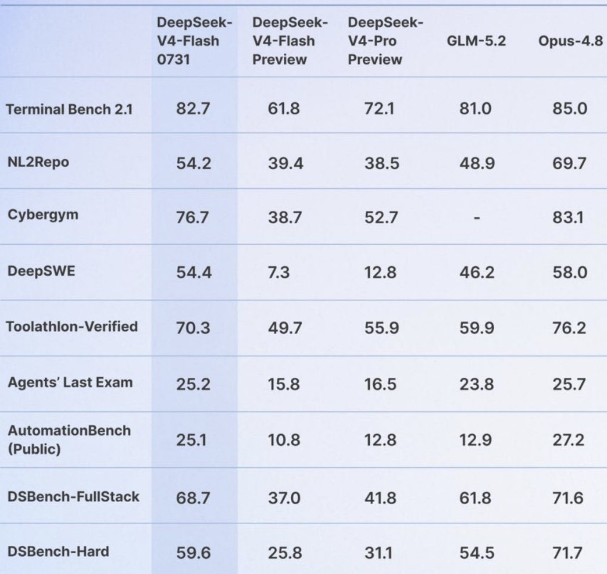

# dgx-spark-2x-deepseek-v4-flash

Two desk-side **NVIDIA DGX Sparks**, one QSFP cable, and this kit — that's everything you
need to serve **DeepSeek-V4-Flash-0731** (a 284B-parameter MoE, ~13B active per token) at
up to **1M tokens of context**. vLLM splits the model across both boxes (tensor-parallel
2), and the head node exposes a plain OpenAI-compatible API on its loopback
(`127.0.0.1:8000`). This repo is the full recipe: configs, scripts, systemd units, and
docs that explain *why* every knob is set the way it is.

**0731 is the official V4-Flash release** (2026-07-31), superseding the
`DeepSeek-V4-Flash-DSpark` preview this kit originally shipped. Same checkpoint family,
same ~155.4 GiB footprint, byte-identical config and tokenizer — but a large jump in
agentic capability (see [Performance](#performance)). Already running the preview?
Upgrading is one variable (`DSPARK_MODEL`, plus its `DSPARK_REVISION` pin), and the
preview stays a supported rollback.

Nothing here is a black box. The serving image is *built* from the pinned, official
arm64 `vllm/vllm-openai:v0.26.0` image plus a small reviewable patch (the gx10 GB10
overlay + five DSv4 backports — [patches/vllm-026-rebase/](patches/vllm-026-rebase/)),
and the weights are pulled from Hugging Face at deploy time. No prebuilt third-party
image, no accounts, no tokens. Prior lanes (0.25.1, 0.21.x) are preserved one config swap
away ([docs/08](docs/08-optimization-and-vllm-025.md)); the latest image update and how
its picks were chosen is [docs/13](docs/13-vllm-026-cand7.md). See [NOTICE](NOTICE) for
upstream attribution.

## Why this kit

Two desktop boxes and one cable get you:

- **A 284B MoE with a 1M context window, at home.** The two Sparks pool ~242 GiB of
  unified memory, and NVFP4 KV quantization stretches that into a **2,948,751-token KV
  pool** — 2.81 full-length 1M sessions at once. Long-context agentic work stops being
  theoretical on this hardware.
- **Real speed, measured — not claimed.** ~34 tok/s for a single stream, ~93 tok/s
  aggregate at concurrency 8, and the DSpark speculative drafter lands **0.796–0.875
  measured acceptance**. Every number ships with its workload and its gate in
  `docs/08`–`docs/13`.
- **One cable, no cluster plumbing.** Tensor-parallel over a single QSFP 200GbE link: no
  Ray, no switch, no Ethernet fabric — NCCL RDMA at ~23 GB/s, vLLM's native `mp` backend,
  and plain systemd user units (no root).
- **Production ops, not a demo.** Self-healing boot-persistent services, an inference
  watchdog, an observability timer, preflight invariant checks, a 100/100 eval gate, a
  loopback-only API by default, and documented rollback rungs for weights, image, and
  config.
- **A trust surface you can actually audit.** Official upstream vLLM image + a ~1.7K-line
  patch + public weights — no prebuilt third-party image, no tokens, no kit-side
  telemetry. Every change to the lane is evidence-gated (same-day A/B, acceptance,
  garble, long-context needles) and written down, so you can check *why* each knob is
  what it is — not just what it is.

## Reproducibility

Everything you need is **public — no accounts, no tokens, anywhere**:

- **Hardware:** 2× DGX Spark (GB10) + one QSFP cable between them + Docker. That's the
  non-negotiable part.
- **Weights:** [`deepseek-ai/DeepSeek-V4-Flash-0731`](https://huggingface.co/deepseek-ai/DeepSeek-V4-Flash-0731)
  is a public Hugging Face repo — no token required. (Preview rollback:
  [`deepseek-ai/DeepSeek-V4-Flash-DSpark`](https://huggingface.co/deepseek-ai/DeepSeek-V4-Flash-DSpark).)
- **Serving image:** the official `vllm/vllm-openai:v0.26.0` (linux/arm64, public on
  Docker Hub), the overlay patch in this repo, and two public git pins (b12x, FlashInfer).
  You never have to trust a community-built image — just upstream vLLM and a ~1.7K-line
  patch you can read in one sitting.
- **Path:** clone → `bringup/00–09` (node prep, fabric check, NCCL bench, image build +
  distribute, weights, smoke test) → `runtime/cluster.env` from the example → systemd units.

Two honest caveats: every number here was measured on one 2× pair — yours will vary —
and the overlay is a delta against vLLM v0.26.0, so future upstream releases need it
re-based (the mechanism, and the gates that prove a rebase healthy, are in
[docs/10](docs/10-vllm-026-rebase.md) and the patch-kit README).

> ⚠️ **Experimental.** The DSpark / GB10 serving stack is fast-moving, largely
> single-author, and partly dependent on prebuilt (non-source-buildable) kernels and
> images. Treat this as experimental and validate on your own hardware behind each
> upstream's own smoke/sanity tests. All performance numbers here are **observations on
> one 2× GB10 pair — not guarantees. Yours will vary.**

---

## Architecture

```
                       control host (your laptop/workstation)
                       runs the numbered scripts over SSH; not in the data path
                                     |
                 ssh $HEAD_HOST      |      ssh $WORKER_HOST   (mDNS / SSH-alias names)
              ┌──────────────────────┴──────────────────────┐
              |                                              |
   ┌──────────────────────┐                      ┌──────────────────────┐
   │  HEAD  (rank 0)       │                      │  WORKER (rank 1)      │
   │  DGX Spark · GB10     │                      │  DGX Spark · GB10     │
   │  ~121 GiB unified mem │                      │  ~121 GiB unified mem │
   │                       │                      │                       │
   │  vLLM serve           │   QSFP 200GbE cable  │  vLLM serve --headless│
   │  --node-rank 0        │◄════════════════════►│  --node-rank 1        │
   │                       │  rail 1: 192.168.177 │                       │
   │  OpenAI API           │  rail 2: 192.168.178 │  (no API listener)    │
   │  127.0.0.1:8000 ◄──┐  │  MTU 9000, dual-twin │                       │
   └────────────────────┼──┘   RoCEv2 / NCCL      └──────────────────────┘
                        │        TP=2, mp backend, rendezvous on HEAD_R1:25000
              your clients (loopback only by default)
```

One physical QSFP port shows up as **two** PCIe "twin" netdevs (~100G each) — using both,
on separate subnets, gets the full ~200G. NCCL runs RDMA over both; the control plane
rides rail 1. TP=2 uses vLLM's native `mp` backend, so there's **no Ray** anywhere. The
**worker boots before the head**; the head then rendezvouses at `MASTER_ADDR:MASTER_PORT`
(= `HEAD_R1:25000`).

---

## Quickstart

Everything except step 3 runs from a **control host** (any machine with SSH to both nodes).
Step 3 runs **on** each node. The repo is organized into `bringup/` (one-time, control-host
setup), `runtime/` (everything a node runs + the lifecycle/ops scripts), and `docs/`. The whole
tree is rsynced to each node *preserving that structure* — the units reference
`%h/dgx-cluster/runtime/…`.

```bash
# 1. Configure — this is the single source of truth for the whole kit.
cp runtime/cluster.env.example runtime/cluster.env
$EDITOR runtime/cluster.env                # set HEAD_HOST / WORKER_HOST (identity block)
export CONTROL_HOST_PUBKEY="$(cat ~/.ssh/id_ed25519.pub)"   # authorized on the nodes

# 2. Copy the kit to each node as your normal login user (the cluster user does not
#    exist yet). The on-node dir MUST be named dgx-cluster; keep bringup/ + runtime/ intact.
rsync -a ./ "$HEAD_HOST:~/dgx-cluster/"
rsync -a ./ "$WORKER_HOST:~/dgx-cluster/"

# 3. One-time node prep — runs ON each node with its role (the only sudo step).
#    Add --firmware FIRST if the two nodes' firmware differ (then reboot, re-run without it).
ssh -t "$HEAD_HOST"   'cd ~/dgx-cluster && bash bringup/00-node-prep.sh head'
ssh -t "$WORKER_HOST" 'cd ~/dgx-cluster && bash bringup/00-node-prep.sh worker'

# 4. Bring up the fabric + build + serve — all from the control host, in order.
bash bringup/01-verify-fabric.sh     # QSFP addressing, MTU 9000, RoCE up, jumbo ping both ways
bash bringup/02-setup-cluster-ssh.sh # node-to-node SSH over the QSFP rail IPs
bash bringup/03-build-nccl-tests.sh  # NCCL v2.30u1 + nccl-tests at sm_121, both nodes
bash bringup/04-run-nccl-bench.sh    # A/B the RDMA arms; put the winner in cluster.env (gate ≥15 GB/s)
bash bringup/05-build-image.sh       # build the 0.26.0 gx10-overlay image (patches/vllm-026-rebase/)
bash bringup/06-distribute-image.sh  # copy the image head → worker over QSFP; verify IDs match
bash bringup/07-download-weights.sh  # pull public weights to the head's token-free HF cache
bash bringup/08-distribute-weights.sh # rsync weights head → worker; verify file/byte parity
bash bringup/09-smoke-serve.sh       # foreground bring-up via compose; /health + a chat completion

# 5. Install the systemd user units, make the cluster primary, evaluate.
bash bringup/install-services.sh     # sync kit + install units on both nodes (does not start them)
bash runtime/cluster-enable.sh       # enable for boot + start (worker-first) + poll /health
bash runtime/eval-cluster.sh         # correctness + throughput + long-context needle probes
```

Call it (from the head node, loopback):

```bash
curl -s http://127.0.0.1:8000/v1/chat/completions \
  -H 'Content-Type: application/json' \
  -d '{
        "model": "deepseek-v4-flash-dspark",
        "messages": [{"role": "user", "content": "Reply with exactly: OK"}],
        "max_tokens": 1024, "temperature": 1.0
      }'
```

Daily ops (all in `runtime/`): `start-cluster.sh` / `stop-cluster.sh` (bring the running cluster
up/down), `cluster-enable.sh` / `cluster-disable.sh` (toggle boot-persistence too), `eval-cluster.sh`,
`metrics.sh`. A `vllm-metrics-watch` user timer on the head runs a read-only observability
watcher (with optional Telegram alerts), and a non-fatal readiness warm-up primes the decode and
tool-parser paths after each head restart — see [docs/07](docs/07-observability-and-warmup.md).
An optional Xid monitor is installed disabled on both nodes; it captures hardware-fault evidence
and alerts but categorically never restarts vLLM.

Running an agent client (Hermes Agent) against the deployment — config profile, switch script,
and the model-specific gotchas: [hermes/README.md](hermes/README.md).

---

## Tunables (the "sweet spot")

All live in `runtime/cluster.env`; `render-env.sh` bakes them into a node-local `.env.dspark`
that compose reads. The full vLLM serve argv lives only in `runtime/docker-compose.dspark.yml`.

| Knob | Default | Meaning |
|---|---|---|
| `MAX_MODEL_LEN` | `1048576` | Context ceiling — the model's true YaRN ceiling (65536×16). Higher boots but extrapolates past calibration. First rung of the OOM ladder. |
| `MAX_NUM_SEQS` | `12` | Concurrent streams. Drop toward `4` → `1` under memory pressure. |
| `MAX_NUM_BATCHED_TOKENS` | `8192` | Prefill batch budget. |
| `GPU_MEMORY_UTILIZATION` | `0.85` | Share of the ~121 GiB **unified** pool. Drop to `0.80` if you co-locate other GPU processes on the head. Never exceed ~0.86. |
| `KV_CACHE_MEMORY_BYTES` | `21316272128` | Pins the KV pool in bytes (**2,948,751 tokens**) instead of profiler sizing — larger and zero boot-to-boot variance. Set = vLLM skips profiling and ignores `GPU_MEMORY_UTILIZATION` for KV sizing. **No free-memory clamp** — an oversized pin OOMs the boot. Unset = profiler sizing returns. See `docs/08`. |
| `MTP_NUM_TOKENS` | `2` | DSpark speculative draft length — the current sweet spot: **+3.8% single-stream decode vs `3`, concurrency-8 tie** (measured, see `docs/11`). `3` is a fine fallback; greedy `5` is unsafe (garble risk, see `docs/03`). |
| `MAX_CUDAGRAPH_CAPTURE_SIZE` | `72` | Keeps the spec-decode decode path graphed at concurrency. Derive as `MAX_NUM_SEQS × (MTP_NUM_TOKENS + 1) × 2` (cap 512) — `72 = 12 × (2+1) × 2`. See `docs/08`. |
| `VLLM_USE_BREAKABLE_CUDAGRAPH` | `1` | The supported CUDA-graph route for this model. **Keep `1`.** See `docs/08`. |
| `TRITON_CACHE_DIR` | `/cache/huggingface/triton-cache-cand7` | Triton kernel cache **must** live on the persistent HF-cache bind — unset falls to container-ephemeral storage and cold-recompiles on every recreate (see `docs/07`). The `-cand7` root follows the source-patch cache-root rule (own roots per source-patch image; see `docs/13`). |
| `SHUTDOWN_TIMEOUT` | `30` | vLLM engine grace period for in-flight requests after SIGTERM. The systemd units provide 90 s total stop headroom. |
| `GLOO_SOCKET_IFNAME` | `enp1s0f1np1` | Pins the CPU-side Gloo coordination group to the stable QSFP control rail; normally matches `NCCL_SOCKET_IFNAME`. |
| `LONG_PREFILL_TOKEN_THRESHOLD` | `4096` | Caps each running long-prefill chunk so short requests interleave — the prefill head-of-line fix. `0`/unset disables it (short-request TTFT regresses under long prefills). See `docs/07`. |
| `DSPARK_REASONING` | `on` | Thinking mode (**production default** — what the Performance numbers were measured at). `on` = server-default thinking + `temp/top_p 1.0`; read the CoT from **`message.reasoning`** (not `reasoning_content`). `off` = non-think greedy (`temp 0`), fastest first token. **With `on`, give requests a generous `max_tokens` (≥1024)** or `content` comes back empty (the max_tokens trap). See `docs/06`. |
| `NCCL_IB_HCA` | `rocep1s0f1,roceP2p1s0f1` | RDMA data path. Default = both RoCE twins (~200G). `bringup/04-run-nccl-bench.sh` A/B-tests this. |

The serve argv also pins `--attention-config '{"backend":"FLASHINFER_MLA_SPARSE_DSV4"}'`
(the SM120 sparse-MLA route — explicit drift-guard; the default would resolve identically)
and `--no-async-scheduling` (on 0.26 the async default would shrink the *reported* KV pool
by ~30% via upstream #47728's doubled sliding-window reservation — measured
throughput-neutral, so the pool comes back for free; see `docs/10`, `docs/11`).

---

## Performance

All measured on our own 2× GB10 pair (`GPU_MEMORY_UTILIZATION=0.85`, `DSPARK_REASONING=on`).
Treat these as **observations, not guarantees** — yours will vary.

**DeepSeek-V4-Flash-0731 (current, 2026-07-31):**

| Metric | Result |
|---|---|
| **Composite eval score** | **100 / 100** — correctness 1.00 · garble-clean 1.00 · latency-SLO 1.00 · spec-decode 1.00 |
| Throughput — single stream (C1) | **34.2 tok/s** best (6 batches) |
| Throughput — aggregate @ concurrency 8 (C8) | **93.0 tok/s** best, ~89.2 mean (6 batches) |
| Spec-decode acceptance (eval-mix / nprobe battery) | **0.796–0.823 / 0.875** (draft len 2, probabilistic) |
| Deep-context retrieval | **3/3 needle HITs @ 944,471 tokens** (10%/90% depths) + 200K; garble 1.00 |
| KV cache pool | **2,948,751 tokens** (pinned) — unchanged vs preview; max concurrency @ 1M ctx **2.81×** |
| Serving image | `vllm-dspark-runtime:v026-gx10-cand7-backports` — official `linux/arm64` `vllm/vllm-openai:v0.26.0` + the gx10 overlay + backports #50004/#49486 + the cand7 increment #48957/#48047/#50330 (throughput-neutral at gate; buys the #50330 draft-quant correctness fix), built by [patches/vllm-026-rebase/](patches/vllm-026-rebase/) — see [docs/13](docs/13-vllm-026-cand7.md) |
| Dependencies | release lock (torch 2.11.0, cutlass-dsl 4.6.0, tvm-ffi 0.1.10, flashinfer-cubin 0.6.14) **except** FlashInfer `0.6.15-dev @0472b9b3` — proven load-bearing (the stock-0.6.14 build crashes on first decode traffic; see `docs/11`) |
| Rollback | weights: flip `DSPARK_MODEL` back to `DeepSeek-V4-Flash-DSpark` + its `DSPARK_REVISION` pin (both checkpoints can stay resident) · image: `vllm-dspark-runtime:v026-gx10-cand4-backports` + its cache roots (first rung), then `vgx10-011-pr47356` (the 0.25.1 lane) |

> ⚠️ **These are short-context numbers.** Every C1/C8 throughput figure above was measured
> at prompts of a few K tokens; **decode rate at 500K+ context is unmeasured on this
> lane.** The open datapoint that motivated measuring it is
> [MiaAI-Lab issue #22](https://github.com/MiaAI-Lab/DeepSeek-v4-Flash-DSpark-2x-DGX-Spark/issues/22):
> on a different lane (Anemll 0.25.2, MTP-5, third-party weights, uncontrolled A/B) a
> reporter saw `nvfp4_ds_mla` decode collapse to ~1 tok/s at ~630K context vs 17.3 tok/s
> on `fp8_ds_mla` — mechanism unclear, but nobody has the measurement here either.
> `runtime/bench-decode-depth.py` closes that blind spot (see
> [docs/07](docs/07-observability-and-warmup.md)); `fp8_ds_mla` is the diagnostic perf arm
> at depth.

**0731 vs the best preview deploy** (same pair, same image, same-day A/B — preview numbers
are the 2026-07-29 n=2 promotion re-measured pre-upgrade):

| Metric | Preview (DSpark) | 0731 | Delta |
|---|---|---|---|
| C8 aggregate tok/s | 94.2 best / ~89.3 mean | 93.0 best / ~89.2 mean | **tie (within noise)** |
| C1 single-stream tok/s | 36.1 best / ~35.8 mean | 34.2 best / ~32.7 mean | **−5…−8%** |
| Spec-decode acceptance — eval workload | 0.788 | **0.796–0.823** | **up** |
| Spec-decode acceptance — nprobe battery | 0.842 | **0.875** | **+3.9%** |
| Needles @ 944K + 200K | 3/3 HIT | 3/3 HIT | unchanged |
| Garble / eval composite | 1.00 / 100 | 1.00 / 100 | unchanged |
| KV pool (pinned) | 2,948,751 tok | 2,948,751 tok | unchanged |

The short version: same speed at concurrency, a small single-stream dip, **better draft
acceptance everywhere** — and the real reason to upgrade is quality, not speed:



DeepSeek's published agentic results for 0731 vs the preview this kit previously deployed:
**Terminal-Bench 2.1 82.7 vs 61.8**, **DeepSWE 54.4 vs 7.3**, **NL2Repo 54.2 vs 39.4**,
Cybergym 76.7 vs 38.7, Toolathlon-Verified 70.3 vs 49.7 — ahead of even the V4-Pro preview
on every row (source: [DeepSeek-V4-Flash-0731 model card](https://huggingface.co/deepseek-ai/DeepSeek-V4-Flash-0731)).
Upgrade evidence + the two offline-cache traps it surfaced: [docs/12](docs/12-dsv4-flash-0731-upgrade.md).

One 0731 quirk worth knowing: give it a prompt with a **numeric length constraint** or a
very long single-shot ask, and it will word-count and re-draft inside its thinking —
coherent, not garble — until the budget runs out. Tight `max_tokens` caps will truncate
the answer. Tool-use and agentic traffic never notice; for long-form asks, leave room or
chunk them. See `docs/12`.

`eval-cluster.sh` prints the composite plus the throughput/latency probes in one run;
`SKIP_TTFT=1 SKIP_LATENCY=1` skips the two slow streaming probes. Prior-lane figures
(0.25.1, 0.21.x) are preserved in [docs/08](docs/08-optimization-and-vllm-025.md); the
0.26.0 promotion evidence is in [docs/10](docs/10-vllm-026-rebase.md), the day-2
qualification round in [docs/11](docs/11-v026-feature-qualification.md), the 0731
model upgrade in [docs/12](docs/12-dsv4-flash-0731-upgrade.md), and the cand7 backport
round in [docs/13](docs/13-vllm-026-cand7.md).

---

## Documentation

| Doc | Covers |
|---|---|
| [docs/01-hardware-and-firmware.md](docs/01-hardware-and-firmware.md) | GB10 / ARM64 / unified memory, CUDA 13, and why **firmware parity** across the two nodes matters. |
| [docs/02-networking-nccl.md](docs/02-networking-nccl.md) | QSFP dual-twin fabric, RoCEv2/GID, MTU 9000, the NCCL A/B benchmark and its gate. |
| [docs/03-model-and-features.md](docs/03-model-and-features.md) | The model, NVFP4-KV, DSpark spec-decode, the garble fix, and image provenance. |
| [docs/04-serving-and-systemd.md](docs/04-serving-and-systemd.md) | The serve profile, TP=2 rendezvous, systemd user units, preflight, and the inference watchdog. |
| [docs/05-troubleshooting.md](docs/05-troubleshooting.md) | OOM ladder, NCCL bandwidth, garbled output, restart deadlocks, and the security/listener audit. |
| [docs/06-reasoning-mode.md](docs/06-reasoning-mode.md) | Turning on thinking mode, the `message.reasoning` field (not `reasoning_content`), the sampling profile, the `max_tokens` trap, tool-call behavior, and client integration. |
| [docs/07-observability-and-warmup.md](docs/07-observability-and-warmup.md) | Observability watcher, the prefill-HoL guard, per-request cached-token telemetry, Telegram alerts, readiness warm-up, the eval composite score, and the decode-at-depth bench (`runtime/bench-decode-depth.py`). |
| [docs/08-optimization-and-vllm-025.md](docs/08-optimization-and-vllm-025.md) | The A/B decision ledger and the **vLLM 0.25.1 promotion** (2026-07-15): the two-candidate distinction, config deltas, hardening pass, residual gaps, and the preserved prior 0.21.x lane + rollback. |
| [docs/09-upstream-backport-candidates.md](docs/09-upstream-backport-candidates.md) | Post-v0.25.1 upstream vLLM fixes verified **absent** in the gx10 image (in-container probes), ranked — the evidence-backed maintainer ask, incl. the +1.8% TPOT DeepSeek-V4 perf commit. |
| [docs/10-vllm-026-rebase.md](docs/10-vllm-026-rebase.md) | The **vLLM 0.26.0 promotion** (2026-07-28): the in-house rebase (official image + gx10 overlay + backports), the two guards it needs, the acceptance-regression hunt, evidence, and rollback. |
| [docs/11-v026-feature-qualification.md](docs/11-v026-feature-qualification.md) | The **0.26.0 feature-qualification round** (2026-07-29): the 12-row release-feature audit (what's active, ineligible, or evidence-backed), the DSpark **n=2** K re-tune, the explicit backend pin, and the FlashInfer vendor-pin crash proof. |
| [docs/12-dsv4-flash-0731-upgrade.md](docs/12-dsv4-flash-0731-upgrade.md) | The **DeepSeek-V4-Flash-0731 model upgrade** (2026-07-31): compatibility proof (byte-identical config/tokenizer, same footprint), the A/B gate numbers vs the preview, the two offline-cache traps (`refs/main`), and the 0731 long-form deliberation trait. |
| [docs/13-vllm-026-cand7.md](docs/13-vllm-026-cand7.md) | The **cand7 backport round** (2026-08-10): the 836-commit post-0.26.0 survey, on-path pick selection (and the cand6 −10.7% rejection lesson), the throughput-neutral gate, and the source-patch cache-root rule. |
| [docs/LONG_CONTEXT_CRASH_FIX.md](docs/LONG_CONTEXT_CRASH_FIX.md) | The `DSPARK_SLOT_CLAMP` long-context crash guard — **legacy no-op on the 0.26 lane** (zero readers in the installed package; the overlay handles the crash class itself), kept for 0.25.1-rollback compatibility. |

---

## License & attribution

Licensed under Apache-2.0 (see [LICENSE](LICENSE)). This kit is orchestration and documentation
only — it vendors no upstream source; the serving image is built from a pinned community recipe and
the weights are pulled from Hugging Face at deploy time. Upstream components (vLLM, the model weights,
the recipe/image, and the GB10 kernels) each ship under their own licenses; see [NOTICE](NOTICE) for
the attribution required by those licenses. Contributions welcome — see [CONTRIBUTING.md](CONTRIBUTING.md).

## Thanks

- **anemll** — the dspark-vllm-gx10 GB10 port this kit's serving lane is built on.
- And everyone running this on their own pair — bug reports with logs are the fastest way to make the kit better.
